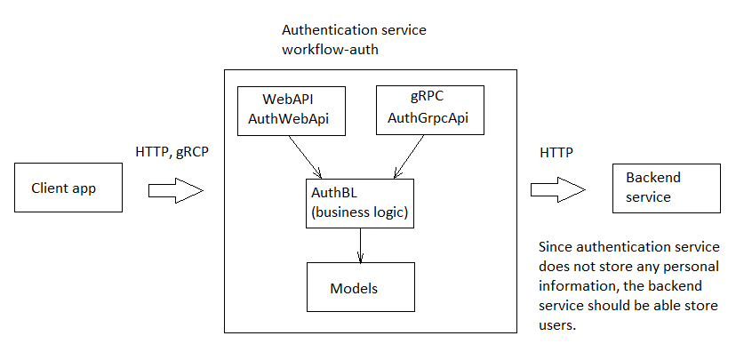

# workflow-auth

Read this in other languages: [English](README.md), [Russian/Русский](README.ru.md).

`workflow-auth` is a service for authentication and getting session tokens.

## Description

- This service writes/reads session tokens in the database.
- PostgreSQL is used as a database.
- In order to reduce the risk of compromise of personal data, the service does not store any data associated with users: only user GUIDs, as well as tables directly related to authentication ("session token", "temporary registration", "suspicious registration").
- Only the "code check" table is stored on the client application.
- Any new login to the application updates the expiration date of the session token.

More detailed description of the service is presented at [this link](docs/description.md).

## Technologies

- .NET 6 (C# 10);
- PostgreSQL;
- Entity Framework;
- LINQ;
- WebAPI, gRPC.

## How to use

This service can be used in two main ways:
- as a **component of microservice architecture**,
- as a **library**.

In order to get this library, execute the following operations on the command line:
```
cd C:\PathToProj\your-project
cd ..
git clone https://github.com/alexeysp11/workflow-lib.git
git clone https://github.com/alexeysp11/workflow-auth.git
cd your-project
```

### Using as a microservice



[delivery-service-csharp](https://github.com/alexeysp11/delivery-service-csharp) could be considered as an example of using the authentication service:


## How to improve this project 

- [TODO](docs/TODO.md)
