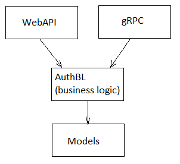

# workflow-auth

Доступно на других языках: [English/Английский](README.md), [Russian/Русский](README.ru.md).

`workflow-auth` - это сервис аутентификации и выдачи сессионных токенов. 

## Описание 

- Данный сервис производит запись/чтение сессионных токенов в БД.
- В качестве БД используется PostgreSQL.
- В целях уменьшения риска компрометации персональных данных, сервис не хранит никаких данных, связанных с пользователями: только GUID пользователей, а также таблицы, непосредственно связанные с аутентификацией (например, "сессионный токен", "временная регистрация", "подозрительная регистрация").
- Любой новый вход в приложение обновляет дату окончания действия сессионного токена.

Более подробное описание работы сервиса можно найти по [данной ссылке](docs/description.ru.md).

## Список технологий 

- .NET 6 (C# 10);
- PostgreSQL;
- Entity Framework;
- LINQ;
- WebAPI, gRPC.

## Рекомендации к использованию 

Данный сервис может быть использован двумя основными способами:
- в качестве **компонента микросервисной архитектуры**,
- в качестве **библиотеки**.

Для того, чтобы загрузить данную библиотеку, выполните следующие операции в командной строке:
```
cd C:\PathToProj\your-project
cd ..
git clone https://github.com/alexeysp11/workflow-lib.git
git clone https://github.com/alexeysp11/workflow-auth.git
cd your-project
```

### Использование в качестве микросервиса 



В качестве примера внешней системы, которая использует данный сервис аутентификации, можно рассмотреть проект [delivery-service-csharp](https://github.com/alexeysp11/delivery-service-csharp):


### Использование в качестве библиотеки 

Проект [ChatCsharp](https://github.com/alexeysp11/ChatCsharp) использует данный сервис аутентификации в качестве библиотеки: 


## Как можно улучшить данный проект

- [TODO](docs/TODO.md)
