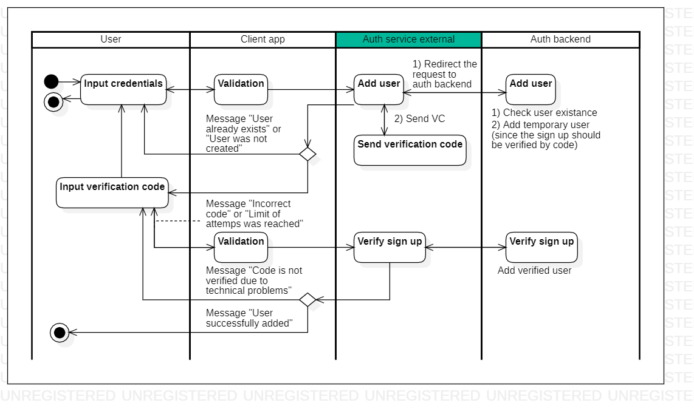
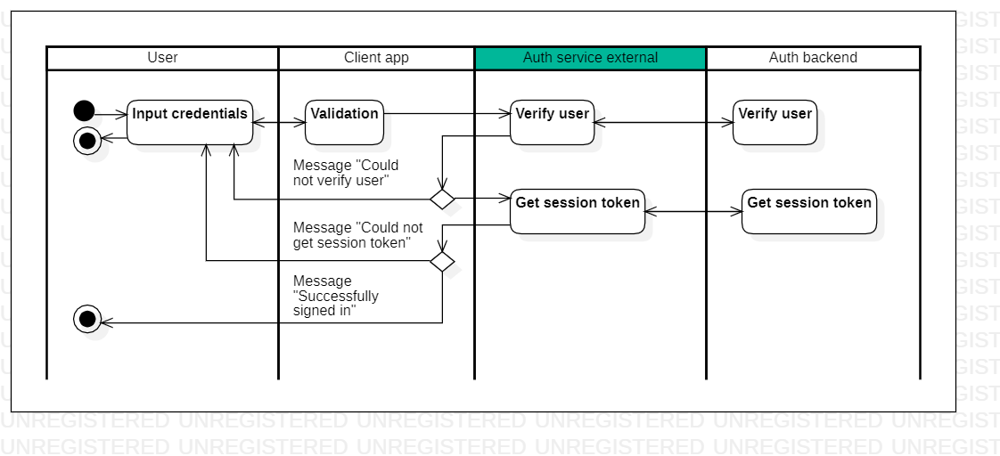

# description

Read this in other languages: [English](description.md), [Russian/Русский](description.ru.md).

## Step-by-step description of how the client application and service work

### Registration

1. The user opens the application and selects "Register".
2. The user enters login, email, phone number and password (password is entered twice).
     - The form validates the entered values.
     - If **validation is failed**, then an error message is displayed (we remain on the form and give the user the opportunity to enter the data again).
     - If **validation is passed**, then a **request to check the existence of the user** is sent to the authentication service in the database (login, email, phone).
         - Since users are not stored on the authentication service, the request must be forwarded to the backend service, which stores user information.
     - If **login does not exist** in the database, then a **request to add a user** to the database is sent to the authentication service, the service returns information on the created user (user creation flag, verification code, date/time of verification code creation).
     - If **login exists**, the message “Sorry, a user with this name already exists. Please try again” will be displayed.
     - All changes at this stage are entered into the “Registration” table.
<!--
     - **Optional** (executed only if necessary at the business logic level of the client application): If **email** and/or **phone exists**, then the message “User with this email and/or phone number” is displayed already exists. For data security reasons, deactivate the previous account or try to remember the password for the previous account" and select "Remember password"/"Deactivate old account"/"Cancel".
         - If the user clicks “Remember password”, he is redirected to the application login form.
         - If the user clicks “Deactivate old entry”, then the user enters an email or phone number on the new form, clicks “Get deactivation code”, a request is sent to the authentication service, the service makes an entry in the “Deactivation” table and in response sends the deactivation code, the user confirms or does not confirm (see point 4). If confirmed, the client application sends a deactivation request, and then all active entries in the user and token tables are marked as outdated and overwritten.
     - On the authentication service side, there is a job that marks entries in the “Registration” table.
-->
3. When adding a user, a verification code is sent to the specified email/phone number.
4. The user enters the verification code.
     - The entered code is compared with the confirmation code from the service.
     - You are given 3-5 attempts to enter the confirmation code.
     - The confirmation code is stored on the form.
         - If the user **closes the application**, then the registration GUID is lost, so even if the user **enters the application again after closing**, he is taken to the registration form and repeats all the steps again (the old attempt must be overwritten in step 1 ).
     - If the user **confirmed the code**, then **we send a request** to the authentication service to **set the registration closing code** as “success”.
5. The user returns to the application login form (login entry).

### Login to the application

1. The user opens the application and selects "Login".
2. The user enters login and password.
     - The form validates the entered values.
     - If **validation fails**, then an error message is displayed (we remain on the form and give the user the opportunity to enter the data again).
     - If **validation passes**, then a **request for user verification** (login, password) is sent to the authentication service.
         - The request is redirected to the backend service.
     - If **the user is not verified**, then we display the error message “Invalid login or password. Please try again.”
     - If **the user is verified**, then a **request to receive a session token** is sent to the authentication service.
         - If, when sending a session token to a client, it turns out that the token has expired, then its expiration date must be updated.
     - All changes at this stage are entered into the “Login to the application” table.
     <!--
     - If there are several login attempts in the temporary table during the day for the same user, then it is likely that they are trying to hack him, so after the nth time the exception “the number of login attempts has been exceeded” should be sent.
     -->
3. The user enters the application.

## Methods for processing network requests

### Sign up 

- **Check user existence** - checking the presence of a user in the database (name: `CheckUserExistance`):
     - input: `UserCredentials`;
     - output: `UserExistance`.
- **Add user** - adding a user (name: `AddUser`):
     - input: `UserCredentials`;
     - output: `UserCreationResult`.
- **Verify sign up** - verification of registration completion (name: `VerifySignUp`):
     - input: `VSURequest`;
     - output: `VSUResponse`.
<!--
- **Get deacitvation code** - getting the deactivation code (name: `GetDeactivationCode`):
     - input: `UserCredentials`;
     - output: `DeactivationCode`.
- **Deactivate users** - deactivate users (name: `DeactivateUsers`):
     - input: `DeactivationRequest`;
     - output: `DeactivationResponse`.
-->

### Login to the application

- **Verify user credentials** - user verification (name: `VerifyUserCredentials`)
     - input: `UserCredentials`;
     - output: `VUCResponse`.
- **Get token by user UID** - updating the session token by user UID (name: `GetTokenByUserUid`)
     - input: `TokenRequest`;
     - output: `SessionToken`.

### JSON objects for internetworking

- **User credentials** - user data (name: `UserCredentials`):
     - `Login: string`,
     - `Email: string`,
     - `PhoneNumber: string`,
     - `Password: string`.
- **User existance** - object of user existence according to the entered data (name: `UserExistance`):
     - `LoginExists: bool`,
     - `EmailExists: bool`,
     - `PhoneNumberExists: bool`,
     - `ExceptionMessage: string`.
- **User creation result** - the result of adding a user to the database (name: `UserCreationResult`):
     - `IsUserAdded: bool`,
     - `SignUpGuid: string`,
     - `VerificationCode: string`,
     - `CodeSendingDt: DateTime`,
     - `ExceptionMessage: string`.
- **Verify sign up request** - request to confirm registration using a verification code (name: `VSURequest`):
     - `SignUpGuid: string`,
     - `TriesNumber: int`,
     - `IsDeprecated: bool`,
     - `IsOverriden: bool`,
     - `SignUpClosingCode: string`.
- **Verify sign up response** - response to confirmation of registration using the verification code (name: `VSUResponse`):
     - `IsSuccessful: bool`,
     - `ExceptionMessage: string`.
- **Verifying user credentials response** - response to verification of user data when entering a login (name: `VUCResponse`):
     - `IsVerified: bool`,
     - `SignInGuid: string`,
     - `UserUid: string`,
     - `ExceptionMessage: string`.
- **Token request** - request to receive a session token for the user (name: `TokenRequest`):
     - `SignInGuid: string`,
     - `UserUid: string`.
- **Session token** - session token (name: `SessionToken`):
     - `TokenGuid: string`,
     - `TokenBeginDt: DateTime`,
     - `TokenEndDt: DateTime`,
     - overridden tokens,
     - `ExceptionMessage: string`.
<!--
- **Deactivation code** - response to the request for a deactivation code (name: `DeactivationCode`):
     - `DeactivationGuid: string`,
     - `Code: string`,
     - `CodeSendingDt: DateTime`,
     - `ExceptionMessage: string`.
- **Deactivation request** - deactivation request (name: `DeactivationRequest`):
     - `DeactivationGuid: string`.
- **Deactivation response** - deactivation result (name: `DeactivationResponse`):
     - `IsSuccessful: bool`,
     - `ExceptionMessage: string`.
-->

## Data storage and processing

### Tables in the database

- **Session token** - session token (name: `session_token`):
     - `session_token_id: integer` - token ID,
     - `token_guid: varchar` - generated token GUID,
     - `token_begin_dt: timestamp` - the beginning of the token,
     - `token_end_dt: timestamp` - end of token validity,
     - `user_guid: varchar` - user GUID (the user himself and his personal data are not stored on the service side).
- **Sign up** - registration (name: `signup`):
     - `signup_id: integer` - registration ID,
     - `signup_guid: integer` - registration GUID,
     - `user_guid: varchar` - GUID of the created user,
     - `verification_code: varchar` - registration confirmation code,
     - `vc_sending_dt: timestamp` - time of sending the confirmation code,
     - `tries_number: integer` - number of attempts to enter the registration code,
     - `signup_begin_dt: timestamp` - start of registration,
     - `signup_end_dt: timestamp` - end of registration,
     - `is_deprecated: boolean` - “deprecated” sign,
     - `is_overriden: boolean` - sign “overwritten”,
     - `auth_closing_code_id`: closing code.
<!--
- **Suspicious sign up** - suspicious registration (name: `suspicios_signup`):
     - repeats the fields of the `signup` table.
-->
- **Sign in** - login to the application (name: `signin`):
     - `signin_id: integer` - login ID,
     - `signin_guid: integer` - login GUID,
     - `user_guid: varchar` - GUID of the existing user,
     - `signin_begin_dt: timestamp` - start of registration,
     - `signin_end_dt: timestamp` - end of registration,
     - `is_deprecated: boolean` - “deprecated” sign,
     - `is_overriden: boolean` - sign “overwritten”,
     - `auth_closing_code_id`: closing code.
<!--
- **Suspicious sign in** - suspicious input (name: `suspicios_signin`):
     - repeats the fields of the `signin` table.
-->
- **Authentication closing code** - authentication closing code (name: `auth_closing_code`):
     - Fields:
         - `auth_closing_code_id: integer` - authentication closing code ID,
         - `guid: string` - UID of the authentication closing code,
         - `name: string` - name.
     - Possible values:
         - `success` - success,
         - `rejectedToProvideVC` - refusal to provide a confirmation code,
         - `tooManyTries` - the number of attempts to confirm the code has been exhausted,
         - `timeout` - fell off due to timeout,
         - `overriden` - overwritten,
         - `cancelled` - cancellation.
<!--
- **Deactivation** - deactivation (name: `deactivation`):
     - `deactivation_id` - deactivation ID,
     - `deactivation_uid` - deactivation UID,
     - `deactivation_code: varchar` - deactivation code,
     - `dc_sending_dt: timestamp` - time of sending the confirmation code,
     - `deactivation_begin_dt: timestamp` - start of deactivation,
     - `deactivation_end_dt: timestamp` - end of deactivation,
     - `tries_number: integer` - number of attempts to enter the deactivation code,
     - `is_deprecated: boolean` - sign of “obsolete deactivation”,
     - `is_overriden: boolean` - sign of “overwritten deactivation”,
     - `deactivation_closing_code_id`: deactivation closing code.
- **Deactivation-user** - deactivation-user (name: `deactivation_user`):
     - `deactivation_id` - deactivation ID,
     - `user_guid: varchar` - GUID of an existing user.
-->